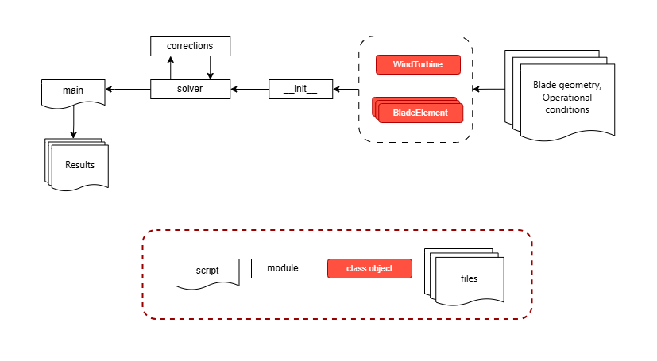

[](https://classroom.github.com/a/zjSXGKeR)
# `windbem` A Blade Element Momentum (BEM) Package 

Team: breeze-tech

## Overview

`windbem` is a modular Python package designed for modelling wind turbines using the Blade Element Momentum (BEM) method. This method uses blade geometry data, operational conditions and airfoil data to compute and plot the power and thrust curves against wind speed based on the optimal operational strategy.

## Quick-start guide

1. Clone the git project
2. In the Anaconda prompt activate an environment that you want to installl the package in or create a new python environment  and activate it
3. Navigate to the cloned location into the final-project-breeze-tech directory in the anaconda prompt
4. Install the package locally in the editable mode using `pip install -e .`

Example usage of functions of this package can be found in the `examples` folder

## Architecture


### \_\_init\_\_.py

#### `windbem.define_turbine(blade_file, operational_file, polar_dir)`
Defines an instance of the `WindTurbine` class with a list of `BladeElement` objects.  **(Requirement 1)**

**Returns:**
```python
Turbine = {
  "Wind Turbine": WindTurbine,
  "Blade Elements": [BladeElement, ...]
}
```


#### `windbem.plot_airfoil_shapes(Turbine)`
Plots airfoil shapes from the given `WindTurbine` object in one plot.  **(Requirement 2)**


#### `windbem.solve(Turbine, V0, correction=False)`
Performs calculations on the `WindTurbine` (+ `BladeElements`) object.  
Runs all functions from `solver.py` one by one.  
If `correction=True`, additionally runs functions from `corrections.py`.  
**(Requirements 3–6)**

- Saves _performance_ (dictionary) as the WindTurbine object's attribute using `save_results()` method.
- Returns _performance_.

> Eventually, `solver.py` functions can be replaced with object methods.  
> However, there will be no longer module `solver.py` and `corrections.py` in our package.


#### `windbem.plot_results(Turbine)`
Plots power and thrust curves based on the previously obtained optimal operational strategy.  
**(Requirement 7)**

> Two extra functions to be added, e.g., printing some results.

---

### classes.py (or defined in \_\_init\_\_.py)

#### `WindTurbine` – class for the wind turbine model

##### `__init__(self, ...):`
```python
self.R =
self.B =
self.dr =
```

##### `save_results(self, performance):`
```python
self.performance = performance
```

---

#### `BladeElement` – class for blade elements

##### `__init__(self, ...):`
```python
self.r =
self.c =
self.local_solidity =
self.twist =
self.af_id =
```

##### `save_results(self, results):`
```python
self.results = results
```

---

### Modules (separate files in /src/)

#### solver.py  
Contains all functions to compute necessary parameters.  
**(Requirements 3–6)**

- `windbem.solver.get_opt_strategy(operational_file, V0)` **(Requirement 6)**
- `windbem.solver.compute_tsr(rot_speed, V0, R)`
- `windbem.solver.compute_flow_angle(...)`
- `windbem.solver.compute_angle_attack(...)`
- `windbem.solver.compute_lift_drag(...)` **(Requirement 3)**
- `windbem.solver.compute_normal_tangential(...)` **(Requirement 4)**
- `windbem.solver.update_induction_factors(...)`
- `windbem.solver.compute_thrust_torque_power(...)` **(Requirement 5)**

---

#### corrections.py (optional, could be merged into solver.py)
Adds functions to apply Prandtl’s tip/hub loss corrections for finite blade effects.

- `windbem.corrections.fun1(...)`
- `windbem.corrections.fun2(...)`

---

### Pseudocode Examples

#### `main.py`
```python
Turbine = windbem.define_turbine(blade_file, operational_file, polar_dir)
V0 = 10

# windbem.solve(Turbine, V0, correction=True)  # This is a shortcut. Below are step-by-step computations:

pitch, rot_speed = windbem.solver.get_opt_strategy(operational_file, V0)
tsr = windbem.solver.compute_tsr(rot_speed, V0, Turbine['Wind Turbine'].R)
...

windbem.corrections.fun1(...)
...

thrust, torque, power, CT, CP = windbem.solver.compute_thrust_torque_power(...)

performance = {...}
Turbine.save_results(performance)

windbem.plot_airfoil_shapes(Turbine)
windbem.print_results(Turbine)
windbem.plot_results(Turbine)
```

---

#### `short.py`
```python
Turbine = windbem.define_turbine(blade_file, operational_file, polar_dir)
V0 = 10

windbem.solve(Turbine, V0, correction=True)

windbem.plot_airfoil_shapes(Turbine)
windbem.print_results(Turbine)
windbem.plot_results(Turbine)
```

## Peer review

[ADD TEXT HERE!]
