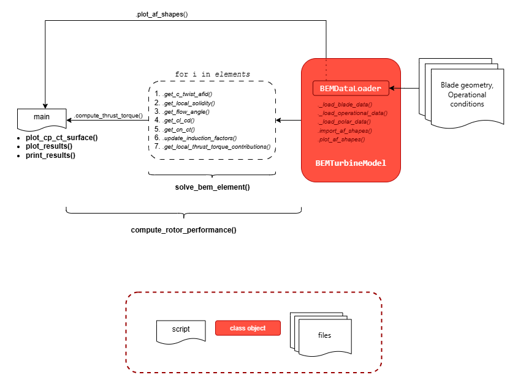

# `windbem` A Blade Element Momentum (BEM) Package 

Team: breeze-tech

## Overview

`windbem` is a modular Python package designed for modelling wind turbines using the Blade Element Momentum (BEM) method. This method uses blade geometry data, operational conditions and airfoil data to compute and plot the power and thrust curves against wind speed based on the optimal operational strategy.

## Quick-start guide

1. Clone the git project
2. In the Anaconda prompt activate an environment that you want to installl the package in or create 
a new python environment  and activate it
3. Navigate to the cloned location into the final-project-breeze-tech directory in the anaconda prompt
4. Install the package locally in the editable mode using `pip install -e .`

Example usage of functions of this package can be found in the `examples` folder

## Architecture

  

Package consists of a constructor file `__init__.py` and modules: `data_io.py` and `compute.py`.  
In the `examples` folder there are two example scripts: `main.py` (with detailed functionalities of the code) and `short.py` (with main functions without intermediate steps).  
Two classes are implemented: `BEMDataLoader` (in data_io.py) and `BEMTurbineModel` (in compute.py).

---
### Classes

#### `BEMDataLoader:`  
Location: \src\data_io.py  
A class for loading data from input files, such as blade geometry and operational conditions. It 
also provides functionality to visualize data, including airfoil shapes. 

Attributes:
- blade_data (DataFrame): Blade geometry data (span, twist, chord, airfoil IDs)
- operational_data (DataFrame): Operational strategy data (wind speed vs pitch and RPM)
- polar_data (list): List of airfoil polar data (Cl, Cd vs alpha)
- rho (float): Air density (kg/m^3)
- blade_rad (float): Rotor radius (m)
- no_blades (int): Number of blades  

Methods:
- _load_blade_data(...)
- _load_operational_data(...)
- _load_polar_data(...)
- import_af_shapes(...)
- plot_af_shapes(...)

---

#### `BEMTurbineModel(BEMDataLoader):`  
Location: \src\compute.py  
A class to implement Blade Element Momentum (BEM) theory for wind turbine performance analysis.  
This class models the aerodynamic performance of a wind turbine rotor using BEM theory, computing 
key performance metrics like power output, thrust, and torque.  
It inherits the properties of BEMDataLoader class.

Methods:
- get_operational_strategy(...)
- get_element_spans(...)
- get_c_twist_afid(...)
- get_local_solidity(...)
- get_flow_angle(...)
- get_angle_attack(...)
- get_cl_cd(...)
- get_cn_ct(...)
- update_induction_factors(...)
- get_local_thrust_torque_contributions(...)
- compute_thrust_torque(...)
---

### Constructor file (\_\_init\_\_.py)
Contains package's main functions.
#### `solve_bem_element(bem_model, r, v0, ...)`  
Solves BEM equations for a single blade element from `BEMTurbineModel` object for given operating conditions.  
Runs methods from `BEMTurbineModel` class one by one.  

#### `compute_rotor_performance(bem_model, v0, ...)`  
Computes overall rotor performance for given operating conditions.  
Runs `solve_bem_element(...)` function on all blade elements and integrates the results.   

#### `compute_power_curve(bem_model)` - computes power and thrust curves over a range of wind speeds.

#### `plot_results(bem_model)` - plots a power curve and thrust curve over a range of wind speeds. 

#### `print_results(performance)` - prints overall rotor performance.  

## Collaboration
The team held regular meetings to review progress, troubleshoot issues, and ensure all tasks were integrated into the main branch.
Pull requests were reviewed to avoid merge conflicts and maintain code quality. Each time a different group member reviwed it.
